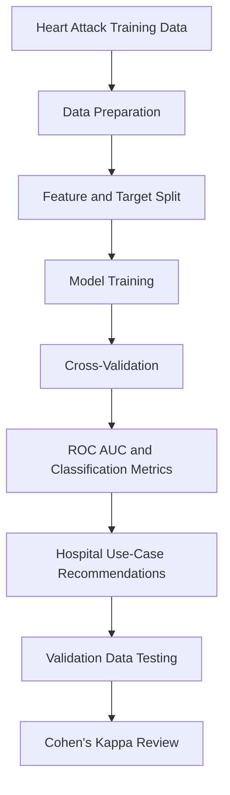
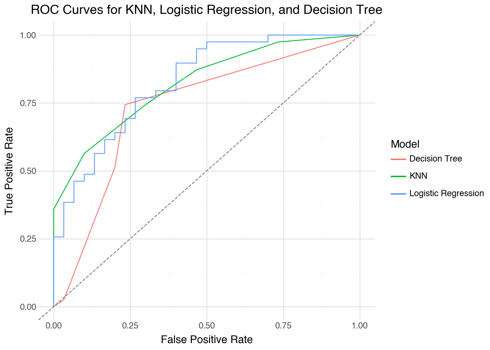

# Heart Attack Risk Classification


---

## Overview

This project analyzes heart attack risk using patient health measurements and compares classification models for predicting whether a patient is high risk. The main goal is to identify the model that performs best overall while also considering which metric matters most in different hospital use cases.

The analysis compares K-nearest neighbors, logistic regression, and a decision tree. I evaluate the models using ROC AUC, accuracy, precision, recall, F1 score, confusion matrices, validation-set performance, and Cohen's Kappa.

---

## Project Workflow



---

## Business Problem

Hospitals need prediction models that can help identify patients who may be at higher risk of a heart attack. In this setting, the best model depends on the clinical goal. Missing a high-risk patient is different from using limited bed space on a patient who is not actually high risk.

This project focuses on questions such as:

- Which model separates high-risk and low-risk patients most effectively?
- Which features are most useful for explaining model behavior?
- Which metric should be prioritized when the hospital has different clinical concerns?
- Does the selected model still perform well on a separate validation dataset?

---

## Dataset

The project uses two heart attack datasets:

- `heart_attack.csv`
- `heart_attack_validation.csv`

The main features include:

- `age`
- `sex`
- `cp`
- `trtbps`
- `chol`
- `restecg`
- `thalach`

### Target Variable

- `output`

This is a supervised classification problem because the goal is to predict whether a patient belongs to the higher-risk or lower-risk class.

---

## Exploratory and Modeling Approach

The notebook focuses on model comparison and clinical interpretation rather than heavy exploratory plotting. I used cross-validation first so that the model comparison would not depend only on one train-test split.

### Methods Used

- K-nearest neighbors classification
- Logistic regression classification
- Decision tree classification
- Cross-validation
- ROC curve comparison
- Confusion matrices
- Validation-set testing
- Cohen's Kappa



---

## Model Performance

### Cross-Validated Model Comparison

Logistic regression had the strongest cross-validated ROC AUC:

- KNN ROC AUC: about `0.814`
- Logistic regression ROC AUC: about `0.854`
- Decision tree ROC AUC: about `0.772`

I would choose logistic regression as the main model because it had the strongest ROC AUC while still being interpretable through its coefficients.

### Classification Metrics

Logistic regression also had the best overall metric profile:

- Accuracy: about `0.773`
- Precision: about `0.778`
- Recall: about `0.815`
- ROC AUC: about `0.854`
- F1 score: about `0.793`

These results show that logistic regression gives the best balance between identifying high-risk patients and avoiding too many incorrect high-risk predictions.

### Hospital Use-Case Metrics

The best metric changes depending on the hospital's goal:

- If missed high-risk patients create legal risk, I would prioritize recall/sensitivity.
- If hospital bed space is limited, I would prioritize precision.
- If the goal is understanding root causes, I would prioritize an interpretable model with strong accuracy and ROC AUC.
- If the model is used to compare against doctor diagnoses, I would prioritize F1 score.

Logistic regression is the strongest recommendation across these use cases because it leads the main metrics and remains interpretable.

### Validation Results

The validation dataset still supports logistic regression:

- KNN correctly identifies `15` high-risk patients and misses `4`.
- Logistic regression also identifies `15` high-risk patients but has fewer false positives.
- The decision tree misses `7` high-risk patients on the validation set.

Cohen's Kappa also supports the same conclusion:

- KNN Kappa: about `0.507`
- Logistic regression Kappa: about `0.585`
- Decision tree Kappa: about `0.485`

---

## Final Interpretation

The analysis shows that logistic regression is the strongest model for this heart attack risk classification task. It performs best by ROC AUC, has the strongest overall classification metrics, and remains easier to explain than KNN.

The decision tree is useful for comparison because it is simple to interpret, but its weaker recall and ROC AUC make it less reliable as the primary model. KNN provides a reasonable benchmark, but logistic regression is the best choice for both performance and practical clinical explanation.

---

## Technologies Used

- Python
- pandas
- NumPy
- scikit-learn
- plotnine
- Jupyter Notebook

---

## Files

```text
compare/
|-- lab7_heart_attack.ipynb
|-- lab7_heart_attack.html
|-- lab7_heart_attack_README.md
|-- heart_attack.csv
|-- heart_attack_validation.csv
|-- readme_assets/
    |-- lab7_heart_attack_preview_1.png
```

---

## How to Run

1. Open `lab7_heart_attack.ipynb` in Jupyter Notebook.
2. Make sure `heart_attack.csv` and `heart_attack_validation.csv` are in the same folder as the notebook.
3. Run the notebook cells in order.

---

## Future Improvements

- Add feature scaling to compare whether KNN improves.
- Tune more decision tree parameters to control overfitting.
- Test additional clinical models such as random forest or gradient boosting.
- Add calibration analysis to evaluate whether predicted probabilities are reliable.
